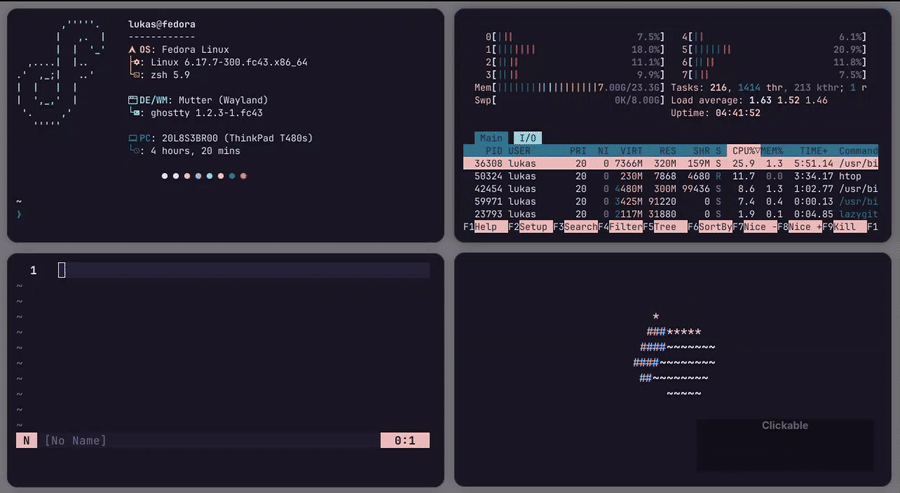
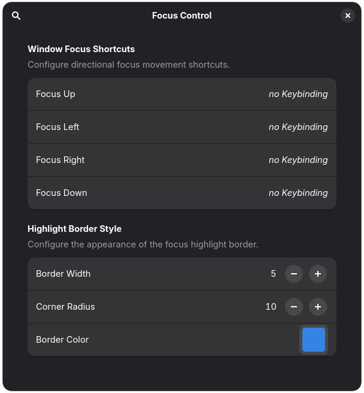

  <!-- Logo -->
  

  <!-- Optional line break -->
   

  <!-- Project Name -->
  <h1 align="center">Focus Control</h1>

  <!-- Badge -->

**Focus Control** — a small GNOME Shell extension that gives you directional
window focusing (like a tiling WM).

---

# Features

* Directional focusing: focus window **Left / Right / Up / Down**.
* Four **configurable** keybindings (one per direction).
* Brief blue border highlights the newly focused window.
* Lightweight and designed to complement tiling/snap extensions (e.g., gTile).

---

# Installation

  

- Install via the GNOME Extensions website

- Or manually install it by unziping and pasting the  current release into `~/.local/share/gnome-shell/extensions/focus-control@yourname/`.

---

# Usage

- Keybindings can be set in the extension settings. (Make sure there is no overlap with existing keybinds)
* Open the extension settings (Extensions app → Focus Control) to assign keybindings.
- Some customization is also possible.

*Tip:* Pair Focus Control with [gTile](https://github.com/gTile) or other tiling helpers — gTile arranges windows, Focus Control lets you navigate them quickly.

    

--- 

# License

MIT — see `LICENSE` for details.

